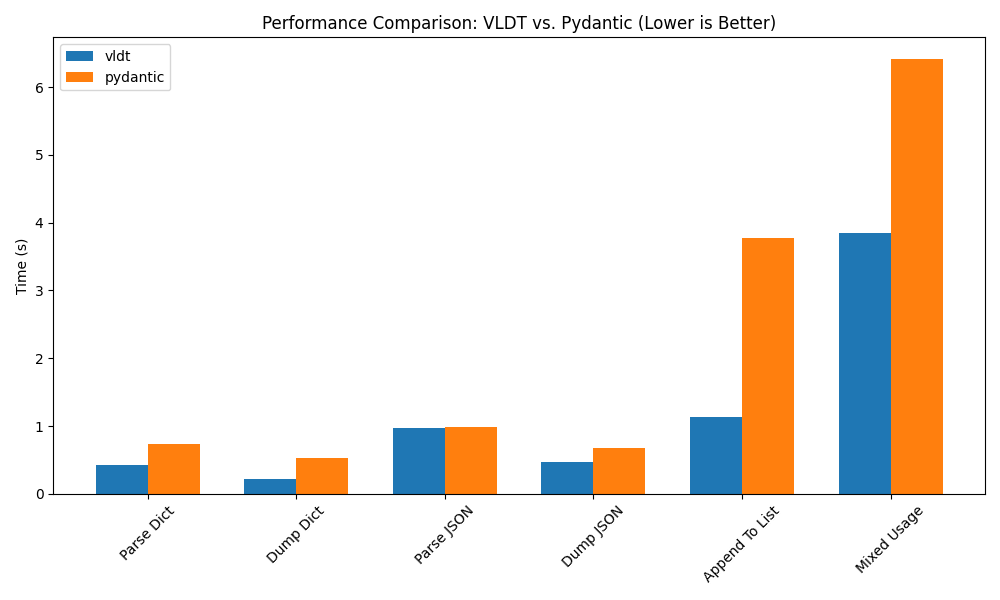

# VLDT: High-Performance Data Validation for Python

VLDT is a Python library with a C++ core. It validates dataclasses and parses JSON and dictionaries with strict type checks.

## Features

- Type validation for dataclass fields
- Field and model validators
- Async validation support
- Dict and JSON parsing
- Field aliases and custom serialization

## Performance

Benchmark settings:
- iterations: 100
- records: 1000

Results (lower is better):

| Operation       | vldt (s) | pydantic (s) | vldt / pyd |
| --------------- | -------- | ------------ | ---------- |
| Parse Dict      | 0.424    | 0.731        | 0.58x      |
| Dump Dict       | 0.216    | 0.529        | 0.41x      |
| Parse JSON      | 0.979    | 0.995        | 0.98x      |
| Dump JSON       | 0.475    | 0.679        | 0.70x      |
| Append To List  | 1.141    | 3.779        | 0.30x      |
| Mixed Usage     | 3.843    | 6.412        | 0.60x      |

vldt is faster on every operation in this workload. Parse JSON is on
par with pydantic-core, while Dict parsing/serialization and list
construction are 30 to 70 percent faster.

The benchmark script is in `load_test/load_test.py`.



## Installation

Install with pip:

```bash
pip install vldt
```

## Basic Usage

```python
from vldt import DataModel

class UserProfile(DataModel):
    username: str
    email: str
    age: int

profile = UserProfile(username="alice123", email="alice@example.com", age=28)
print(profile.username, profile.email, profile.age)
```

## Defaults and Optional Fields

```python
from vldt import DataModel
from typing import Optional

class UserProfile(DataModel):
    username: str
    email: str
    country: str = "USA"
    phone: Optional[str]

profile = UserProfile(username="bob", email="bob@example.com", phone=None)
print(profile.country)
```

## Field Options

```python
from vldt import DataModel, Field

class Order(DataModel):
    order_id: int
    status: str = Field(default="pending")

order = Order(order_id=101)
print(order.status)
```

## Nested Models

```python
from typing import Union, List, Optional
from vldt import DataModel

class Address(DataModel):
    street: str
    zipcode: Union[int, str]
    country: str = "USA"

class Order(DataModel):
    order_id: int
    items: List[str]
    shipping_address: Optional[Address] = None

address = Address(street="123 Main St", zipcode=90210)
order = Order(order_id=1001, items=["book", "pen"], shipping_address=address)
print(order.shipping_address.zipcode)
```
